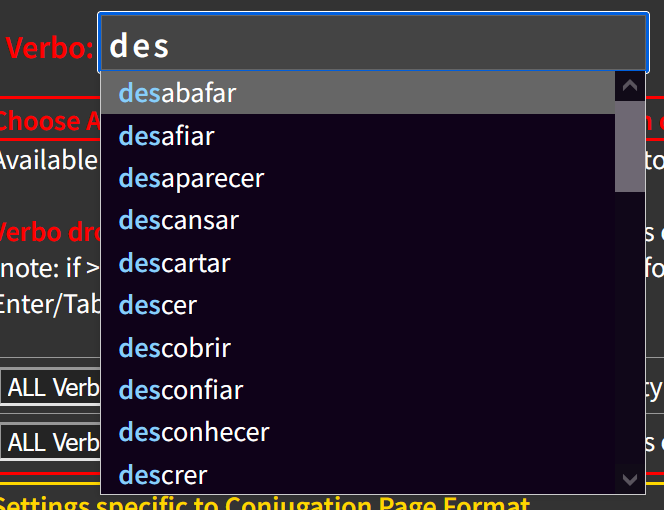

# jsautocompletedropdowncontrol : JavaScript / ES6+ Class-based implementation of an autocomplete dropdown list select control.

This is a custom JavaScript dropdown-list control that includes these features:  
* Turns an editable HTML DIV (contenteditable="true") into an editable DIV with 
dropdown selection capabilities;  
* Incrementally updates available options (shown in the dropdown) as user types, 
including visual highlighting of matched-character(s) as typed;  
* Ability to limit user to choosing only one of the choices provided (aka, limit-to-list);  
* If limit-to-list option is enabled, the control automatically selects the 
next-closest-choice-value when a focus-leave-event occurs, even if the entry-field is left empty, 
partially-filed, or with a invalid-choice typed in;  
* Automatically positions cursor at end of text upon selection or tabbing into the
  control when values already exist, thus backspace-from-end is possible vs. del-from-begin;  
* It is fast, and relatively simple code, which makes use of some newer browser features
  like mutationObservers (for keyboard and pasted-values detection);  
* Callback for onSelect event (essentially onChange); currently fires as soon as selection is
  changed, but code rather easily altered to only fire on focus leaving the control.  
 
__See source code for usage example code__ and detailed functionality notes.
  

## Self-Contained : no reliance on external libraries
There is no reliance on any other libraries; all functionality is contained within this project;  
The dropdown select component is a self-contained single JS Class that is instantiated 
wherever you need a dropdown list.  

* __JavaScript Notes__  
    * uses ES6+ Class functionality and features including MutationObserver and paste 
handling via ExecCommand.  
    * Note that ExecCommand has been flagged as obsolete on MDN, even though it is still widely 
    supported in Chrome and other major browsers and likely will remain so for ages since there is no 
    easy standard direct replacement alternative.  
    See this: https://stackoverflow.com/questions/60581285/execcommand-is-now-obsolete-whats-the-alternative
  
* __CSS__ — a minimal amount of CSS is necessary to style the dropdown, including controlling 
how many maximum options are visible in the dropdown.
  

This application has been __tested with Google Chrome browser and Firefox__.  
__Firefox Note__: the MutationObserver oddly does not trigger on the first character typed into a field, 
but only upon the second or subsequent characters. This seems to be a bug (or odd "feature") with FF.
  

## Screenshot / Example 
Here is an example of the dropdown select as it appears when typing characters into the editable DIV field
associated with the dropdown; this shows how the matching list elements are displayed in the dropdown 
with their current matched letters highlighted (and a scrollbar to access the entire updated list 
of potential desired entries).
  

 